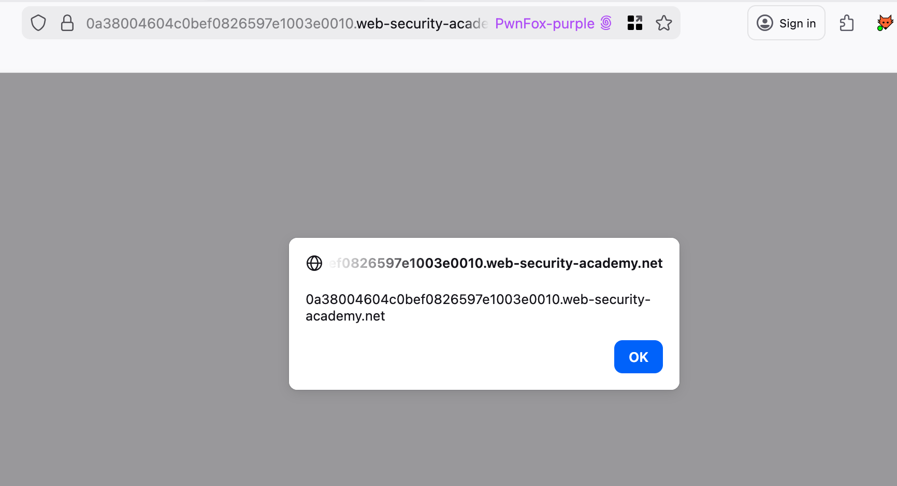

---
tags:
  - xss
  - dom
---
# DOM XSS in `document.write` sink using source `location.search` inside a select element

## Instructions

This lab contains a DOM-based cross-site scripting vulnerability in the stock checker functionality. It uses the JavaScript `document.write` function, which writes data out to the page. The `document.write`function is called with data from `location.search` which you can control using the website URL. The data is enclosed within a select element.

To solve this lab, perform a cross-site scripting attack that breaks out of the select element and calls the `alert` function.

## Solution

Notice that this application has functionality to check the stock of certain items at particular locations. Sending the following request adds a new selection option:

```text title="Initial request"
https://0a38004604c0bef0826597e1003e0010.web-security-academy.net/product?productId=1&storeId=Test123
```

Note that our input is reflected inside of a `<option>` tag.


Also observe the following JavaScript:


This is taking input from the `storeId` parameter, and is writing it to the page inside of an option tag using the `document.write` function. 

We can break out of this context using the following string:

```text title="Working payload"
https://0a38004604c0bef0826597e1003e0010.web-security-academy.net/product?productId=1&storeId=Test123%3C/option%3E%3C/select%3E%3Cscript%3Ealert(document.domain)%3C/script%3E
```

Our alert fires and the lab is solved. 



## Lesson learned

Pay particular attention to client-side JavaScript code, as it can give a good indication of user input that's being handled in unsafe ways. If you find a dangerous sink, try to escape the current context to get the payload to fire. 