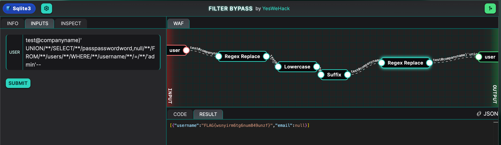

---
tags:
  - sql
  - injection
  - filter-bypass
---
# Filter Bypass

This one was tricky. To solve this lab, we need to bypass several filters. First, spaces are filtered, and so is the word "password". 

The payload that works to solve this lab is:

```text title="SQL filter bypass"
test@companyname)'
UNION/**/SELECT/**/passpasswordword,null/**/FROM/**/users/**/WHERE/**/username/**/=/**/'admin'--
```

Let's break this down:

According to PortSwigger [research](https://portswigger.net/support/sql-injection-bypassing-common-filters), comments can be used to bypass a filter on spaces. So instead of spaces, I'm using `/**/` instead. That bypasses the first part. 

Then, the word "password" is filtered. However, it's not being filtered recursively, so we can add "password" in the middle of the word. That way, when the filter strips out the first "password" it finds, the rest of the string will collapse and we will have bypassed the filter. 



