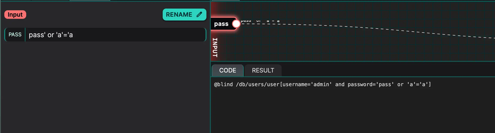

---
tags:
  - xpath
  - injection
---
# Simple Login Bypass

To solve this lab, we just need to bypass the login and login as the admin.

The following payload bypasses the login form:

```text title="Simple login bypass"
pass' or 'a'='a
```



