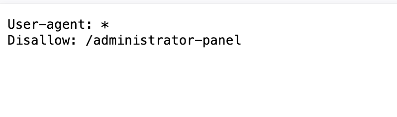

---
tags:
  - authz
---
# Unprotected admin functionality

## Instructions

This lab has an unprotected admin panel.

Solve the lab by deleting the user `carlos`.

## Solution

Check the `robots.txt` file to find the location of the `/administrator-panel`.

Once there, just delete carlos and solve the lab.

