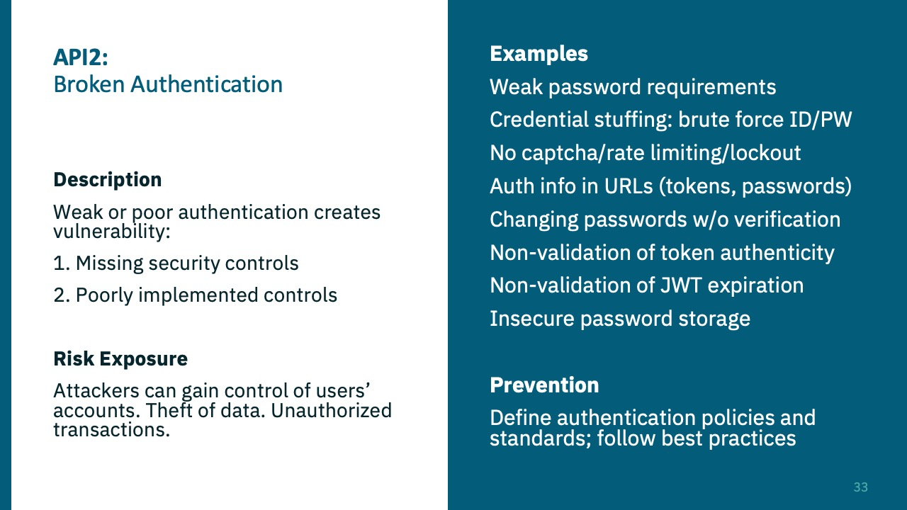
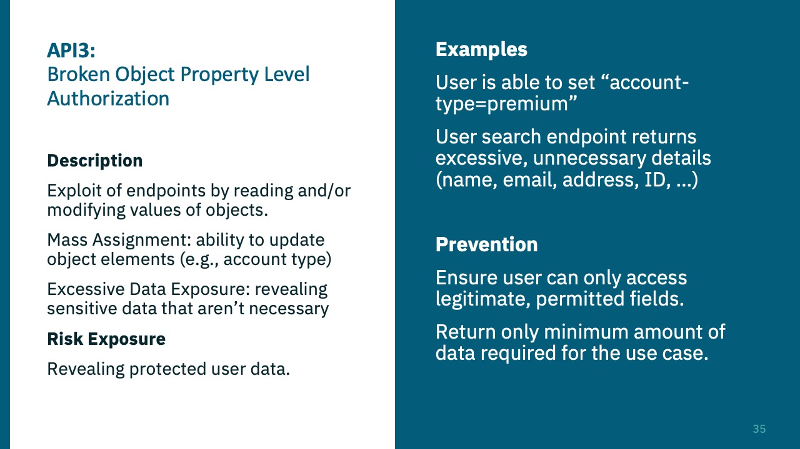
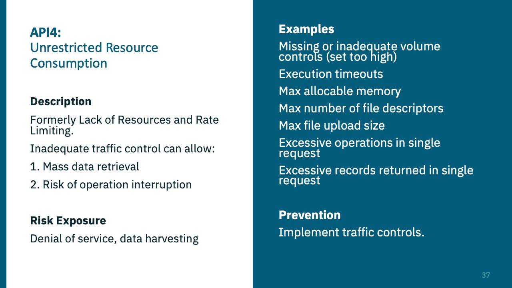
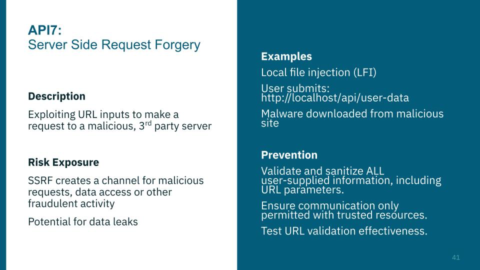
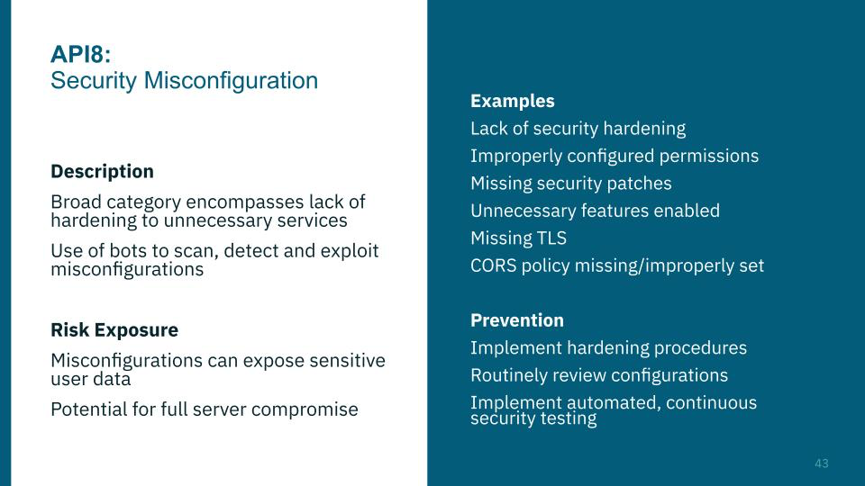

# API Testing

## Definitions

??? tip "OWASP API top-10"

	All of these are taken directly from APISecUniversity. 
	
	??? example "Broken Object Level Authorization"
		### Broken Object Level Authorization
		
	
	??? example "Broken Authentication"
		### Broken Authentication
		
	
	??? example "Broken Object Property Level Authorization"
		### Broken Object Property Level Authorization
		
	
	??? example "Unrestricted Resource Consumption"
		### Unrestricted Resource Consumption
		
	
	??? example "Broken Function Level Authorization"
		### Broken Function Level Authorization
		
	
	??? example "Unrestricted Access to Sensitive Business Flows"
		### Unrestricted Access to Sensitive Business Flows
		
	
	
	??? example "Server-Side Request Forgery"
		### Server-Side Request Forgery
		
	
	
	??? example "Security Misconfigurations"
		### Security Misconfigurations
		
	
	??? example "Improper Inventory Management"
		### Improper Inventory Management
		
	
	??? example "Unsafe Consumption of APIs"
		### Unsafe Consumption of APIs
		

## API Authentication

??? tip "Types of authentication"

	### Basic Authentication
	
	- Uses the HTTP Authorization header with the "Basic" scheme
	- Base-64 encoded value of the `username:password`
	
	### API Keys
	
	- No standard way of presenting the API key
	- Username and password at once
	- Only machine identity
	
	### TLS Authentication
	
	- Using mutual TLS for authentication
	- Both parties present certificates to authenticate themselves
	- Conveys machine identities

	### OAuth and OpenID Connect
	
	- OAuth is a delegation protocol
		- API access is the main goal
	- OpenID Connect is an Identity layer on top of OAuth
		- Defines user authentication metadata
		- Can control authentication
		- Federation
	

### OAuth

OAuth is a delegation protocol

4 actors

- Resource Owner
	- "The user"
- Client
	- 3rd party application
- Authorization Server
	- The server that handles the delegation auth
- Resource Server
	- Stores the resource owner's data - "the API"

- [ ] OAuth delegates access to applications on a user's behalf
- [ ] Delegation != authorization

## API Recon

Check for:

- [ ] URL naming schemes
- [ ] Look for the use of JSON or XML
	- [ ] `/application/json`, `/application/xml`
- [ ] Watch responses
	- [ ] `{something}`
- [ ] 